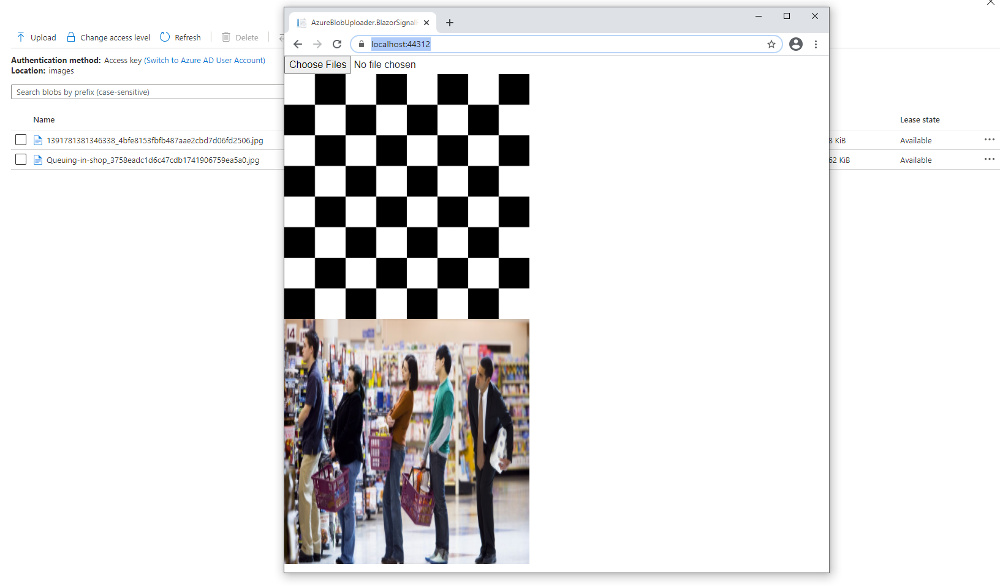

# AzureBlobUploader
Project for university project - showing and uploading photos on azure blob.

It was used in the Blazor server project because the Blazor client does not support encryption dll (used to connect to azure).



secrets.json schema

```
{
  "AzureConfiguration": {
    "AccountName": "",
    "AccountKey": "",
    "ImageBlobName": ""
  }
}
```
